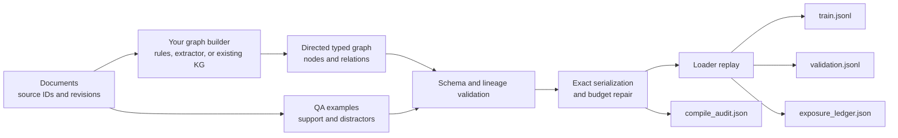

# KG-SFT Contracts

`kgsft-contracts` is a Python library for validating and compiling
evidence-grounded QA records into auditable supervised fine-tuning (SFT)
datasets. It keeps document and graph provenance attached to context chunks,
preserves protected example fields during token-budget repair, and records what
a loader retains or drops.

The package covers dataset preparation and validation. It accepts a graph made
by your existing extractor, rules, graph database, or manual curation; it does
not extract a knowledge graph from raw text. It also does not provide a
retriever, train a language model, or calculate model-quality scores.

## Features

- Typed schemas for source references, evidence chunks, QA examples, graph
  nodes, and directed graph relations.
- Validation of document- and graph-origin provenance before compilation.
- Deterministic removal of low-priority distractors when an example exceeds a
  token budget.
- Hash-based protection of the question, target, task type, support, and
  example-level provenance.
- Replayable loader adapters with per-example retention and split records.
- Evaluation grouping for questions that share support documents.
- A RuBQ 2.0 adapter for converting a public QA format into the canonical
  example schema.

## Quick start

The project requires Python 3.10 or newer. With
[uv](https://docs.astral.sh/uv/) installed, run:

```bash
uv run --frozen python scripts/run_public_smoke.py
uv run --frozen python -m unittest tests.test_kgsft_contracts
```

The smoke test compiles the synthetic Atlas fixture twice and verifies that the
outputs are deterministic. A successful run includes:

```json
{
  "status": "pass",
  "examples": 2,
  "nodes": 4,
  "directed_relations": 3,
  "edited_examples": 1,
  "retained_graph_origin_rows": 1,
  "all_examples_retained": true,
  "protected_invariants_preserved": true,
  "deterministic_rerun": true
}
```

## Workflow



### Inputs

| Input | Format | Required information |
| --- | --- | --- |
| Graph | One JSON object | Graph ID, provenance-carrying nodes, and directed typed relations |
| Examples | JSONL | Stable example ID, question, target, support chunks, optional distractors, and source references |
| Loader adapter | Python implementation | Exact serialization, token IDs, and deterministic split assignment |

The authoritative JSON Schemas are
[`graph.schema.json`](kgsft/schemas/graph.schema.json) and
[`example.schema.json`](kgsft/schemas/example.schema.json).

## Build the graph input

`kgsft-contracts` is deliberately graph-builder agnostic. Start with documents
and any extraction process you trust, then normalize its output into one
`GraphBundle`:

1. Give every source document a stable `source_id`; add its `revision`, `uri`,
   and SHA-256 digest when available.
2. Create stable, globally unique IDs for entities or versions in `nodes`.
3. Create a typed relation for each directed fact. For example,
   `atlas-v2 --REQUIRES--> oauth2` is not interchangeable with the reverse edge.
4. Attach one or more `source_refs` to every node and relation.
5. When a QA chunk was produced from the graph, set `origin` to `graph`, list
   the producing node or relation IDs in `graph_record_ids`, and retain a shared
   source reference.

The validator rejects unknown graph-record IDs, dangling relation endpoints,
duplicate IDs, non-directed relations, and graph/chunk lineage with no shared
`source_id`:

```bash
uv run --frozen kgsft validate \
  --graph examples/atlas/graph.json \
  --examples examples/atlas/examples.jsonl
```

The complete source-to-graph walkthrough is in
[`examples/atlas/README.md`](examples/atlas/README.md). The graph schema stores
provenance and direction; ontology design and entity/relation extraction remain
the caller's responsibility.

### Outputs

| File | Contents |
| --- | --- |
| `train.jsonl` | Validated and repaired examples assigned to the training split |
| `validation.jsonl` | Validated and repaired examples assigned to validation |
| `compile_audit.json` | Graph summary, invariant hashes, token counts, edits, and aggregate exposure |
| `exposure_ledger.json` | Per-example retention state, token count, assigned split, and reason |

## Installation

Using an editable virtual environment:

```bash
python3 -m venv .venv
. .venv/bin/activate
python -m pip install -e .
kgsft --help
```

Alternatively, `uv run --frozen kgsft ...` runs the CLI directly from a
checkout without manually activating an environment.

## Atlas tutorial

[`examples/atlas`](examples/atlas/README.md) is a self-contained synthetic example.
It contains two versions of a fictional service runbook:

- version 2 requires OAuth2 and supersedes version 1;
- version 1 used an API key;
- graph relations preserve both their type and direction;
- each QA row contains verified support and a graph-linked distractor.

The small fixture budget makes one row remove its distractor while the other
keeps a graph-origin distractor. This demonstrates repair and retained graph
lineage in the same run.

### 1. Validate the inputs

```bash
uv run --frozen kgsft validate \
  --graph examples/atlas/graph.json \
  --examples examples/atlas/examples.jsonl
```

### 2. Compile an SFT bundle

```bash
uv run --frozen kgsft compile \
  --graph examples/atlas/graph.json \
  --examples examples/atlas/examples.jsonl \
  --output-dir /tmp/kgsft-atlas \
  --max-tokens 36 \
  --validation-fraction 0.1 \
  --seed 228
```

### 3. Inspect the result

```bash
ls -1 /tmp/kgsft-atlas
python -m json.tool /tmp/kgsft-atlas/compile_audit.json
python -m json.tool /tmp/kgsft-atlas/exposure_ledger.json
```

The complete inputs are available in
[`examples.jsonl`](examples/atlas/examples.jsonl) and
[`graph.json`](examples/atlas/graph.json), so the tutorial can also be
used as a template for a new dataset.

## Use a production loader

The Atlas CLI uses `FixtureLoaderAdapter`, a deterministic
whitespace-token adapter intended only for demonstration. For production
compilation, implement the `LoaderAdapter` protocol with the serializer,
tokenizer, and split logic used by the real training pipeline:

```python
from typing import Any, Sequence

from kgsft import ContractExample


class ProductionLoaderAdapter:
    name = "production-loader-v1"

    def serialize(self, example: ContractExample) -> Any:
        ...

    def token_ids(self, serialized: Any) -> Sequence[int]:
        ...

    def partition(self, example_id: str) -> str:
        ...
```

Use the same adapter for budget repair and loader replay:

```python
from kgsft import repair_to_budget, replay_loader

adapter = ProductionLoaderAdapter()
result = repair_to_budget(
    example,
    serialize=adapter.serialize,
    count_tokens=lambda value: len(adapter.token_ids(value)),
    max_tokens=1024,
)
ledger = replay_loader([result.example], adapter, max_tokens=1024)
```

Distractors must be supplied in retention-priority order, with the least
important chunk last. Repair removes chunks from the tail and fails explicitly
if protected content still exceeds the budget.

## Import RuBQ 2.0

The optional RuBQ adapter demonstrates how an external public QA format can be
mapped into the same canonical schema. Download the official question and
paragraph files, then run:

```bash
uv run --frozen kgsft import-rubq \
  --questions /path/to/RuBQ_2.0_test.json \
  --paragraphs /path/to/RuBQ_2.0_paragraphs.json \
  --output /tmp/rubq100.jsonl \
  --report /tmp/rubq100.preflight.json \
  --limit 100 \
  --seed 228
```

The importer retains RuBQ question IDs, answer-bearing and related paragraph
IDs, Wikidata metadata, and release provenance. It admits only rows whose
referenced paragraphs can be resolved.

[`public_validation/rubq100_preflight.json`](public_validation/rubq100_preflight.json)
is a text-free record of a checked 100-row conversion against the official
release. The RuBQ files themselves are not redistributed and remain covered by
their original CC BY-SA 4.0 license. This preflight checks format portability;
it is not a model benchmark or a throughput benchmark.

## Group evaluation rows by support source

Questions backed by the same source document can be grouped before statistical
analysis:

```python
from kgsft import support_document_components

diagnostics = support_document_components(
    [
        {"example_id": "q1", "support_document_ids": ["doc-a"]},
        {"example_id": "q2", "support_document_ids": ["doc-a", "doc-b"]},
        {"example_id": "q3", "support_document_ids": ["doc-c"]},
    ]
)
print(diagnostics["component_sizes"])
# [2, 1]
```

This helper reports dependence components. Metric values and statistical tests
remain the caller's responsibility.

## Public API

| API | Purpose |
| --- | --- |
| `ContractExample`, `EvidenceChunk`, `SourceRef` | Build and validate canonical QA examples |
| `GraphBundle`, `GraphNode`, `GraphRelation` | Build provenance-carrying directed graph records |
| `build_multidigraph` | Materialize a NetworkX `MultiDiGraph` |
| `validate_graph_lineage` | Resolve graph-origin chunks to graph records and shared sources |
| `repair_to_budget` | Fit examples by removing distractors only |
| `replay_loader` | Produce per-example loader exposure records |
| `compile_dataset` | Compile a complete bundle with the public fixture adapter |
| `support_document_components` | Group evaluation rows sharing support documents |

## Repository layout

```text
.
|-- kgsft/                     # library and CLI
|   |-- adapters/rubq.py       # RuBQ-to-contract adapter
|   |-- schemas/               # canonical JSON Schemas
|   |-- compiler.py            # deterministic compilation
|   |-- exposure.py            # loader adapters and exposure ledger
|   |-- graph.py               # directed graph construction
|   |-- schema.py              # evidence objects and invariants
|   `-- transforms.py          # distractor-only budget repair
|-- examples/atlas/            # graph-building guide and end-to-end fixture
|-- public_validation/         # text-free public-format preflight
|-- scripts/run_public_smoke.py
|-- tests/test_kgsft_contracts.py
|-- pyproject.toml
`-- uv.lock
```

## License

The package source is released under the MIT License. See [`LICENSE`](LICENSE).
