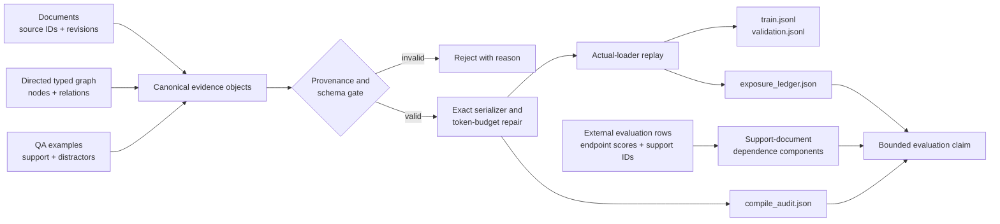
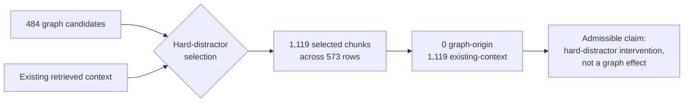

# KG-SFT Contracts

`kgsft-contracts` is a small, fail-closed compiler for turning evidence-bearing
QA records and typed graph records into auditable SFT datasets. It accompanies
the paper *KG-SFT Contracts: Auditing Graph-Origin Context and Effective
Supervision in Enterprise RAG Adaptation*.

> **One-line idea:** do not claim that graph evidence trained a model until the
> evidence can be traced from its source, through the compiled example and the
> real loader, to the evaluation claim.

This package is not an inference-time GraphRAG system. It does not train or
evaluate the proprietary model. Instead, it creates the records needed to
answer four easily confused questions:

1. Which document or graph record produced each context chunk?
2. Which fields may be changed to satisfy the token budget?
3. Which compiled rows did the actual loader retain and assign to a split?
4. Which evaluation rows share source documents and therefore are dependent?

## Why this is different

A conventional data builder can finish successfully while silently dropping
examples, losing graph provenance, or truncating verified support. KG-SFT
Contracts treats those events as contract violations or auditable state
transitions rather than implementation details.

| Conventional pipeline shortcut | KG-SFT Contracts behavior |
| --- | --- |
| Store context as untyped text | Require roles, source revisions, and graph-record lineage |
| Treat relations as unordered pairs | Preserve typed direction in a `MultiDiGraph` |
| Truncate any field to fit | Remove distractors only; fail if protected content still cannot fit |
| Assume a generated row was used for training | Replay the supplied loader and record retained/dropped/split states |
| Treat every evaluation question as independent | Build dependence components from shared support documents |
| Report a graph effect because a graph was configured | Require row-level graph-origin exposure before admitting that claim |

## Pipeline at a glance



The arrows are the contribution: each boundary emits inspectable records.
Configuration alone is not treated as exposure, and loader retention is not
mislabelled as optimizer exposure. The package does not calculate model-quality
scores: a declared external evaluator supplies endpoint values, while
`support_document_components` identifies which evaluation rows share evidence.

The package makes three boundaries explicit:

1. **Evidence contract:** every example, chunk, graph node, and directed
   relation carries source provenance. Graph-origin distractors point to the
   graph records that produced them.
2. **Exposure contract:** the caller supplies the exact serializer/tokenizer.
   Budget repair may remove distractors only, then loader replay records
   intended, retained, train-assigned, and validation-assigned rows. It never
   labels a row optimizer-exposed without a training trace.
3. **Claim contract:** evaluation helpers form dependence components from
   shared support documents so the unit of evidence is stated before
   uncertainty is calculated.

## What the paper audit found

The confidential case had a graph candidate pool, but candidate availability
did not become graph exposure:



This does not say that knowledge graphs are generally useless. It says that
the configured graph path did not supply the selected distractors in this run,
so model changes cannot be attributed to graph-origin context. The compiler's
purpose is to make that distinction visible before a paper or deployment claim
is made.

## Five-minute Atlas walkthrough

The public fixture is deliberately small and synthetic:

- the version-2 runbook says that Service Atlas requires OAuth2;
- the version-1 runbook says that it used an API key;
- the graph stores both directed `REQUIRES` relations and a directed
  `SUPERSEDES` relation;
- each question has verified support from the correct version and a
  graph-linked distractor from the other version;
- a 32-token fixture budget forces distractor-only repair while preserving the
  question, target, and support.

A complete canonical input row looks like this:

```json
{
  "example_id": "atlas-q1",
  "question": "Which authentication method is required for Service Atlas version 2?",
  "support": [{
    "chunk_id": "atlas-v2-auth",
    "text": "Service Atlas version 2 requires OAuth2 authentication.",
    "role": "support",
    "origin": "document",
    "source_refs": [{"source_id": "atlas-runbook-v2", "revision": "2"}]
  }],
  "distractors": [{
    "chunk_id": "atlas-v1-auth",
    "text": "Service Atlas version 1 authenticates with an API key.",
    "role": "distractor",
    "origin": "graph",
    "graph_record_ids": ["rel-v1-requires-api-key"],
    "source_refs": [{"source_id": "atlas-runbook-v1", "revision": "1"}]
  }],
  "target": "OAuth2.",
  "task_type": "answer",
  "source_refs": [{"source_id": "atlas-runbook-v2", "revision": "2"}]
}
```

The complete input is in `examples/atlas/examples.jsonl`; the authoritative
contract is `kgsft/schemas/example.schema.json`.

## One-command public smoke test

Run commands from the directory containing `pyproject.toml`. With `uv`
installed, this command creates an isolated environment, compiles the Atlas
fixture twice, and verifies identical output hashes:

```bash
uv run python scripts/run_public_smoke.py
```

Expected high-level output:

```json
{
  "status": "pass",
  "examples": 2,
  "nodes": 4,
  "directed_relations": 3,
  "edited_examples": 2,
  "removed_distractor_chunks": 2,
  "all_examples_retained": true,
  "protected_invariants_preserved": true,
  "deterministic_rerun": true
}
```

## Install and compile the Atlas example

```bash
python3 -m venv .venv
. .venv/bin/activate
python -m pip install -e .

kgsft validate \
  --graph examples/atlas/graph.json \
  --examples examples/atlas/examples.jsonl

kgsft compile \
  --graph examples/atlas/graph.json \
  --examples examples/atlas/examples.jsonl \
  --output-dir /tmp/kgsft-atlas \
  --max-tokens 32 \
  --validation-fraction 0.1
```

The command writes four inspectable artifacts:

| Output | What it proves | What it does not prove |
| --- | --- | --- |
| `train.jsonl` | Repaired rows assigned to the train split by the loader adapter | That an optimizer consumed every row |
| `validation.jsonl` | Repaired rows assigned to validation | Model quality or transfer |
| `compile_audit.json` | Graph counts, provenance status, invariant hashes, edits, removals, and aggregate exposure | A causal graph effect |
| `exposure_ledger.json` | Per-row token count, retained/dropped state, split, and reason | Optimizer exposure without an external training trace |

The smoke test uses `FixtureLoaderAdapter`, whose whitespace token counter is
only a public demonstration. Production use must supply the real serializer,
tokenizer, and deterministic split behavior through `LoaderAdapter`.

## Import RuBQ 2.0

Download the official RuBQ 2.0 question and paragraph JSON files, then run:

```bash
kgsft import-rubq \
  --questions /path/to/RuBQ_2.0_test.json \
  --paragraphs /path/to/RuBQ_2.0_paragraphs.json \
  --output /tmp/rubq100.jsonl \
  --report /tmp/rubq100.preflight.json \
  --limit 100 \
  --seed 228
```

Only rows with a non-empty answer and resolvable
`paragraphs_uids.with_answer` are admitted; every selected `all_related`
paragraph must resolve as well. The importer preserves RuBQ question IDs,
answer-bearing and related paragraph IDs, Wikidata entity/property metadata,
and release provenance. The checked official test-file preflight is recorded
in `public_validation/rubq100_preflight.json`. RuBQ is licensed separately
under CC BY-SA 4.0; this repository does not redistribute its records.

For the pinned official files, a successful seed-228 preflight reports 2,330
input rows, 1,694 eligible answer-bearing rows, 100 selected rows, 160 support
chunks, 2,108 related distractors, and zero unresolved paragraph references.
The selected ID roster has SHA-256
`e4267cc2e6d3138330aaa250d5a70ae6bf928565c9946a2d3894c299f38b8ed0`;
the aggregate report records both official input-file hashes so a reviewer can
detect a different release without redistributing its text.

The RuBQ command validates schema portability. It does not run GigaChat or
claim that public RuBQ quality predicts the confidential enterprise result.

## Use an exact production loader

Implement the `LoaderAdapter` protocol in `kgsft.exposure`:

```python
class LoaderAdapter(Protocol):
    name: str

    def serialize(self, example: ContractExample) -> Any: ...
    def token_ids(self, serialized: Any) -> Sequence[int]: ...
    def partition(self, example_id: str) -> str: ...
```

Pass the same serializer and token counter to `repair_to_budget`. The caller
orders distractors by retention priority; the repair removes them from the
tail, serializes again, and repeats until the row fits. If the row cannot fit
after all distractors are removed, it fails rather than truncating verified
support, the question, or the target.

## Which command should I run?

| Goal | Command |
| --- | --- |
| Verify installation and determinism | `uv run python scripts/run_public_smoke.py` |
| Validate canonical local inputs | `kgsft validate --graph ... --examples ...` |
| Compile audited train/validation files | `kgsft compile --graph ... --examples ... --output-dir ...` |
| Convert an official RuBQ subset | `kgsft import-rubq --questions ... --paragraphs ... --output ... --report ...` |
| Run focused tests | `python -m unittest tests.test_kgsft_contracts` |

## Repository map

```text
.
|-- kgsft/                     # installable library and CLI
|   |-- adapters/rubq.py       # public RuBQ-to-contract adapter
|   |-- schemas/               # canonical JSON Schemas
|   |-- compiler.py            # deterministic compile pipeline
|   |-- exposure.py            # loader protocol and exposure ledger
|   |-- graph.py               # directed provenance-carrying graph
|   |-- schema.py              # typed evidence objects and invariants
|   `-- transforms.py          # distractor-only token repair
|-- examples/atlas/            # synthetic end-to-end fixture
|-- public_validation/         # text-free RuBQ preflight aggregate
|-- scripts/run_public_smoke.py
|-- tests/test_kgsft_contracts.py
|-- pyproject.toml
|-- uv.lock
`-- LICENSE
```

## Paper-to-artifact map

| Paper object | Public implementation |
| --- | --- |
| Evidence contract and protected fields | `kgsft/schema.py`, `kgsft/graph.py`, and JSON Schema under `kgsft/schemas/` |
| Exact-token invariant repair | `kgsft/transforms.py` and `kgsft/compiler.py` |
| Loader-visible exposure ledger | `kgsft/exposure.py` |
| Support-document dependence components | `kgsft/evaluation.py` |
| Public-schema portability | `kgsft/adapters/rubq.py` and `public_validation/rubq100_preflight.json` |
| End-to-end reproducibility check | `examples/atlas/`, `scripts/run_public_smoke.py`, and `tests/test_kgsft_contracts.py` |

The public smoke report is the executable counterpart of the three horizontal
lanes in the paper figure: provenance-carrying input becomes a compiled
example, the exact-token interface produces an exposure ledger, and shared
support sources define claim-level dependence components.

## Non-released components

This alpha release validates compilation contracts and supplies a reproducible
public example. It does not claim that graph topology improves answer quality,
that retained rows reached an optimizer, or that the public fixture reproduces
the confidential enterprise evaluation. Enterprise documents, QA records,
model outputs, serializer/tokenizer implementation, model weights, and server
paths are deliberately excluded.

## License

The package source is released under the MIT License in `LICENSE`. RuBQ 2.0 is
licensed separately under CC BY-SA 4.0 and is not redistributed here.
